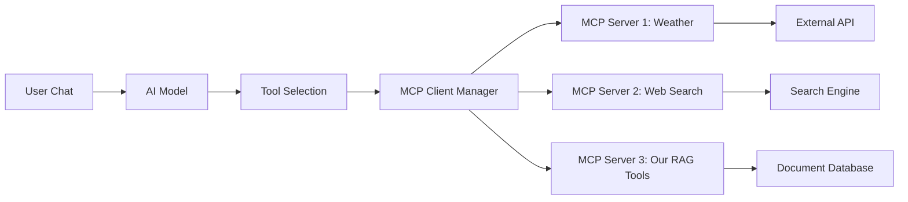

# 🔌 **MCP Integration Guide for RAG Application**
## *Adding Model Context Protocol Support to Our Document RAG System*

---

## 📋 **Executive Summary**

Based on analysis of [cgoinglove/better-chatbot](https://github.com/cgoinglove/better-chatbot), this document provides a comprehensive guide for integrating Model Context Protocol (MCP) functionality into our existing RAG application. MCP enables seamless integration of external tools and services, transforming our document search system into a powerful AI assistant platform.

## 🎯 **What is MCP Integration?**

MCP (Model Context Protocol) allows chatbots to:
- **Connect to external tools** (web search, browsers, APIs, databases)
- **Execute commands dynamically** based on user requests
- **Extend functionality** without modifying core chat logic
- **Manage tool permissions** and access control
- **Support both local and remote MCP servers**

**Example**: Instead of just searching documents, users could ask "Search our knowledge base for solar panel info AND get current market prices from the web" - combining our RAG with external data sources.

---

## 🏗️ **MCP Architecture Overview**

### **Core Components**

1. **MCP Client Manager** (`MCPClientsManager`)
   - Manages multiple MCP server connections
   - Handles tool discovery and execution
   - Provides auto-disconnect and resource management

2. **MCP Servers** (External processes)
   - Custom tools (weather, web search, file operations)
   - Third-party integrations (GitHub, databases, APIs)
   - Local scripts and remote services

3. **Tool Integration Layer**
   - Converts MCP tools to Vercel AI SDK format
   - Handles tool calls within chat context
   - Manages permissions and filtering

### **How It Works**



---

## 📦 **Required Dependencies**

### **Core MCP Dependencies**
```json
{
  "@modelcontextprotocol/sdk": "^1.17.1"
}
```

### **Additional Dependencies** (from better-chatbot)
```json
{
  "chokidar": "^4.0.3",
  "consola": "^3.4.2", 
  "ioredis": "^5.7.0",
  "ts-safe": "^0.0.5",
  "zod": "^3.25.76"
}
```

### **Installation**
```bash
npm install @modelcontextprotocol/sdk chokidar consola ioredis ts-safe zod
```

---

## 🔧 **Step-by-Step Integration Process**

### **Phase 1: Core MCP Infrastructure**

#### **1. Create MCP Type Definitions**
```typescript
// types/mcp.ts
export interface MCPServerConfig {
  type: 'stdio' | 'remote';
  name: string;
  command?: string;
  args?: string[];
  env?: Record<string, string>;
  url?: string;
  headers?: Record<string, string>;
}

export interface MCPToolInfo {
  name: string;
  description: string;
  inputSchema: any;
}

export interface MCPServerInfo {
  name: string;
  config: MCPServerConfig;
  status: 'connected' | 'disconnected' | 'loading' | 'authorizing';
  error?: string;
  toolInfo: MCPToolInfo[];
}
```

#### **2. Implement MCP Client**
Create `lib/ai/mcp/create-mcp-client.ts` with:
- Connection management (stdio/HTTP/SSE transports)
- Auto-disconnect functionality
- Tool discovery and execution
- Error handling and reconnection logic

#### **3. Implement MCP Client Manager**
Create `lib/ai/mcp/create-mcp-clients-manager.ts` with:
- Multiple client management
- Tool aggregation across servers
- Storage persistence (database or file-based)
- Concurrent tool execution

#### **4. Database Schema for MCP Servers**
```sql
CREATE TABLE mcp_servers (
  id UUID PRIMARY KEY DEFAULT gen_random_uuid(),
  name VARCHAR(255) NOT NULL UNIQUE,
  config JSONB NOT NULL,
  created_at TIMESTAMP DEFAULT NOW(),
  updated_at TIMESTAMP DEFAULT NOW()
);
```

### **Phase 2: API Integration**

#### **1. MCP Management API Routes**

**`/api/mcp/route.ts`** - List and manage MCP servers
```typescript
export async function GET() {
  const clients = await mcpClientsManager.getClients();
  return Response.json({ servers: clients.map(c => c.client.getInfo()) });
}

export async function POST(request: Request) {
  const { name, config } = await request.json();
  await mcpClientsManager.persistClient({ name, config });
  return Response.json({ success: true });
}
```

**`/api/mcp/[id]/route.ts`** - Individual server management
```typescript
export async function DELETE(req: Request, { params }: { params: Promise<{ id: string }> }) {
  const { id } = await params;
  await mcpClientsManager.removeClient(id);
  return Response.json({ success: true });
}
```

#### **2. Enhanced Chat API Integration**

Modify `app/api/chat/route.ts` to include MCP tools:

```typescript
import { mcpClientsManager } from '@/lib/ai/mcp/mcp-manager';

export async function POST(request: Request) {
  // ... existing code ...
  
  // Load MCP tools
  const mcpTools = await mcpClientsManager.tools();
  
  // Combine with existing RAG tools
  const allTools = {
    ...mcpTools,
    ...existingRAGTools,
  };
  
  const result = await streamText({
    model: selectedModel,
    messages,
    tools: allTools,
    // ... other options
  });
  
  return result.toDataStreamResponse();
}
```

### **Phase 3: UI Integration**

#### **1. MCP Server Management Interface**

Create `components/mcp/mcp-server-manager.tsx`:
```typescript
export function MCPServerManager() {
  return (
    <Card>
      <CardHeader>
        <CardTitle>MCP Servers</CardTitle>
      </CardHeader>
      <CardContent>
        <MCPServerList />
        <MCPServerAddDialog />
      </CardContent>
    </Card>
  );
}
```

#### **2. Tool Mention System**

Add `@tool` mentions in chat:
```typescript
// In chat input component
<Input 
  placeholder="Type @ to mention tools or ask about documents..."
  onKeyDown={handleMentions}
/>
```

#### **3. Enhanced Knowledge Garden**

Extend existing Knowledge Garden with MCP tools:
```typescript
// Add to components/knowledge-garden/knowledge-garden.tsx
const mcpTools = [
  { name: 'web_search', description: 'Search the web for information' },
  { name: 'github_search', description: 'Search GitHub repositories' },
  // ... other tools
];
```

---

## 🛠️ **Creating Custom MCP Servers**

### **1. Document RAG MCP Server**

Create `custom-mcp-server/rag-server.ts`:
```typescript
import { McpServer } from "@modelcontextprotocol/sdk/server/mcp.js";
import { StdioServerTransport } from "@modelcontextprotocol/sdk/server/stdio.js";
import { z } from "zod";

const server = new McpServer({
  name: "beforest-rag-server",
  version: "1.0.0",
});

server.tool(
  "search_documents",
  "Search documents in the knowledge base",
  {
    query: z.string(),
    bucketId: z.string().optional(),
    limit: z.number().default(5),
  },
  async ({ query, bucketId, limit }) => {
    // Your existing RAG search logic
    const results = await searchDocuments(query, bucketId, limit);
    
    return {
      content: [
        {
          type: "text",
          text: JSON.stringify(results, null, 2),
        },
      ],
    };
  },
);

server.tool(
  "upload_document",
  "Upload a new document to the knowledge base",
  {
    name: z.string(),
    content: z.string(),
    bucketId: z.string(),
  },
  async ({ name, content, bucketId }) => {
    // Your document upload logic
    const result = await uploadDocument(name, content, bucketId);
    
    return {
      content: [
        {
          type: "text", 
          text: `Document "${name}" uploaded successfully to bucket ${bucketId}`,
        },
      ],
    };
  },
);

const transport = new StdioServerTransport();
await server.connect(transport);
```

### **2. Package.json Scripts**
```json
{
  "scripts": {
    "mcp:rag": "tsx custom-mcp-server/rag-server.ts",
    "mcp:weather": "tsx custom-mcp-server/weather-server.ts"
  }
}
```

---

## ⚙️ **Configuration System**

### **1. File-Based Configuration** (`mcp-config.json`)
```json
{
  "servers": {
    "beforest-rag": {
      "type": "stdio",
      "command": "npm",
      "args": ["run", "mcp:rag"],
      "description": "Internal document search and management"
    },
    "web-search": {
      "type": "remote", 
      "url": "https://api.exa.ai/mcp",
      "headers": {
        "Authorization": "Bearer ${EXA_API_KEY}"
      },
      "description": "Web search capabilities"
    }
  }
}
```

### **2. Database-Based Configuration**

```typescript
// lib/ai/mcp/db-mcp-config-storage.ts
export class DbMCPConfigStorage implements MCPConfigStorage {
  async save(server: McpServerInsert): Promise<McpServerSelect> {
    const [result] = await db.insert(mcpServers)
      .values(server)
      .returning();
    return result;
  }

  async loadAll(): Promise<McpServerSelect[]> {
    return db.select().from(mcpServers);
  }
  
  // ... other methods
}
```

---

## 🔐 **Security & Permissions**

### **1. Tool Filtering by User**
```typescript
export function filterMCPToolsByUser(
  tools: Record<string, VercelAIMcpTool>,
  userId: string,
  permissions: UserPermissions
): Record<string, VercelAIMcpTool> {
  return Object.fromEntries(
    Object.entries(tools).filter(([_, tool]) => {
      return permissions.allowedMCPServers.includes(tool._mcpServerId);
    })
  );
}
```

### **2. Tool Mentions & Scoping**
```typescript
// Only enable mentioned tools for specific conversations
export function filterMCPToolsByMentions(
  tools: Record<string, VercelAIMcpTool>,
  mentions: ChatMention[]
) {
  if (mentions.length === 0) return tools;
  
  return Object.fromEntries(
    Object.entries(tools).filter(([_, tool]) => {
      return mentions.some(m => 
        (m.type === "mcpTool" && m.name === tool._originToolName) ||
        (m.type === "mcpServer" && m.serverId === tool._mcpServerId)
      );
    })
  );
}
```

### **3. Environment Variable Security**
```typescript
// Secure environment variable handling
const ALLOWED_ENV_VARS = ['EXA_API_KEY', 'GITHUB_TOKEN'];

function sanitizeEnvVars(env: Record<string, string>) {
  return Object.fromEntries(
    Object.entries(env).filter(([key]) => ALLOWED_ENV_VARS.includes(key))
  );
}
```

---

## 📊 **Enhanced Chat Integration**

### **1. Tool Execution in Chat Context**
```typescript
// In shared.chat.ts
export function loadMcpTools(opt?: {
  mentions?: ChatMention[];
  allowedMcpServers?: Record<string, AllowedMCPServer>;
}) {
  return safe(() => mcpClientsManager.tools())
    .map((tools) => {
      if (opt?.mentions?.length) {
        return filterMCPToolsByMentions(tools, opt.mentions);
      }
      return filterMCPToolsByAllowedMCPServers(tools, opt?.allowedMcpServers);
    })
    .orElse({} as Record<string, VercelAIMcpTool>);
}
```

### **2. Streaming Tool Results**
```typescript
// Support streaming results from MCP tools
export async function executeToolWithStreaming(
  toolName: string,
  args: any,
  dataStream: DataStreamWriter
) {
  const result = await mcpClientsManager.toolCall(toolName, args);
  
  // Stream intermediate results
  dataStream.write(formatDataStreamPart("tool_result", {
    toolCallId: generateId(),
    result: result
  }));
  
  return result;
}
```

### **3. Tool Choice Modes**
```typescript
// Allow users to control tool usage
export type ToolChoiceMode = 'auto' | 'manual' | 'none';

export function getToolsForMode(
  mode: ToolChoiceMode,
  allTools: Record<string, Tool>
) {
  switch (mode) {
    case 'none':
      return {};
    case 'manual':
      return excludeToolExecution(allTools);
    case 'auto':
    default:
      return allTools;
  }
}
```

---

## 🧪 **Testing & Development**

### **1. MCP Server Testing**
```typescript
// test/mcp/rag-server.test.ts
describe('RAG MCP Server', () => {
  test('should search documents', async () => {
    const client = await createTestMCPClient();
    const result = await client.callTool('search_documents', {
      query: 'solar panels',
      limit: 3
    });
    
    expect(result.content[0].text).toContain('solar');
    expect(JSON.parse(result.content[0].text)).toHaveLength(3);
  });
});
```

### **2. Development Scripts**
```json
{
  "scripts": {
    "dev:mcp": "concurrently \"npm run dev\" \"npm run mcp:rag\"",
    "test:mcp": "vitest test/mcp/",
    "mcp:list": "tsx scripts/list-mcp-servers.ts"
  }
}
```

---

## 🚀 **Implementation Roadmap**

### **Phase 1: Foundation (Week 1-2)**
- [ ] Install MCP SDK and dependencies
- [ ] Create basic MCP client and manager classes
- [ ] Set up database schema for MCP servers
- [ ] Create simple custom RAG MCP server

### **Phase 2: Core Integration (Week 3-4)**
- [ ] Integrate MCP tools into chat API
- [ ] Add MCP server management API routes
- [ ] Create UI components for server management
- [ ] Implement tool mention system in chat

### **Phase 3: Enhanced Features (Week 5-6)**
- [ ] Add OAuth support for remote MCP servers
- [ ] Implement tool filtering and permissions
- [ ] Create advanced custom MCP servers
- [ ] Add streaming tool execution

### **Phase 4: Production Ready (Week 7-8)**
- [ ] Comprehensive testing and error handling
- [ ] Security auditing and permissions
- [ ] Performance optimization
- [ ] Documentation and user guides

---

## 💡 **Use Cases for Our RAG System**

### **Enhanced Document Interaction**
- **"Search our solar panel docs AND get current market prices"**
- **"Compare our permaculture guide with latest research papers"**
- **"Upload this PDF and summarize it with web context"**

### **Multi-Source Intelligence**
- **"Find community governance examples in our docs and similar projects on GitHub"**
- **"Analyze our water management docs against current weather forecasts"**
- **"Search meeting minutes for budget discussions and get current exchange rates"**

### **Automated Workflows**
- **"When new sustainability docs are uploaded, check them against web sources and create summaries"**
- **"Monitor specific document topics and alert when relevant news appears"**
- **"Cross-reference internal policies with external compliance requirements"**

---

## ⚠️ **Important Considerations**

### **1. Performance Impact**
- MCP tools add latency to chat responses
- Implement auto-disconnect for unused connections
- Use tool mentions to limit execution scope

### **2. Security Concerns**
- Validate all MCP server configurations
- Implement strict permission systems
- Monitor tool usage and API calls

### **3. User Experience**
- Clear indication when tools are being used
- Graceful fallbacks when tools fail
- Intuitive tool discovery and management

### **4. Maintenance**
- Regular updates to MCP SDK
- Monitor MCP server health and uptime
- Backup and restore server configurations

---

## 🎯 **Conclusion**

MCP integration transforms our simple document RAG system into a comprehensive AI assistant platform. By following this guide, we can:

✅ **Maintain existing functionality** while adding powerful new capabilities  
✅ **Provide seamless tool integration** without disrupting current workflows  
✅ **Enable extensibility** for future tool additions  
✅ **Ensure security and permissions** are properly managed  
✅ **Create a foundation** for advanced AI assistant features  

The implementation follows proven patterns from better-chatbot while adapting to our specific RAG architecture and requirements.

---

*Ready to transform your document search into an intelligent assistant platform? Start with Phase 1 and build incrementally.*